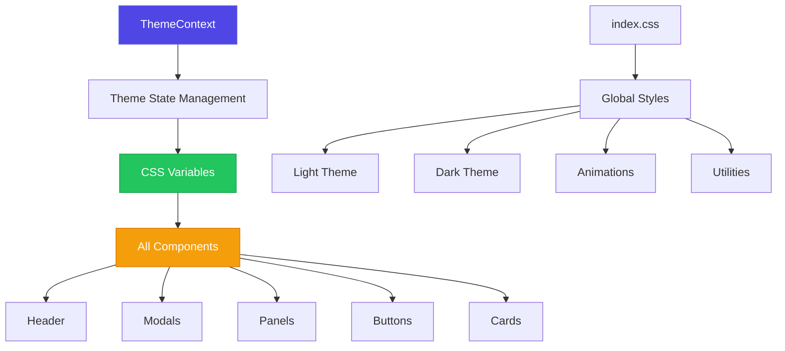
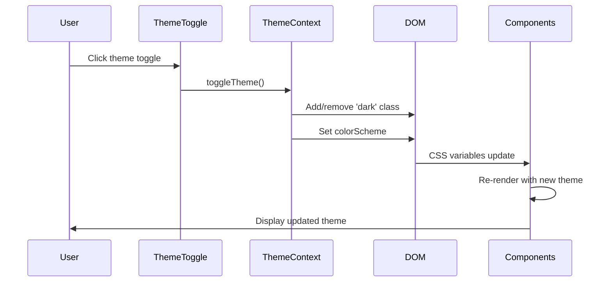

# Design Document: Global Premium Design System

## Overview

Apply the premium design system globally across all UI components in Yao Editor v2. The system provides a distinctive, production-grade interface with:
- Cohesive visual language across all components
- Light and dark theme support
- Premium gradients, shadows, and animations
- Refined typography and spacing
- Accessibility and performance optimizations

## Architecture



## Main Algorithm/Workflow



## Components and Interfaces

### Component 1: ThemeContext (Already Implemented)

**Purpose**: Manage theme state and provide theme switching functionality

**Interface**:
```typescript
interface ThemeContextValue {
  theme: 'light' | 'dark'
  setTheme: (theme: 'light' | 'dark') => void
  toggleTheme: () => void
}
```

**Responsibilities**:
- Maintain theme state
- Persist theme to localStorage
- Apply theme to document.documentElement
- Provide toggle function

### Component 2: CSS Variables System

**Purpose**: Define all design tokens as CSS variables for theme switching

**Variables**:
- Background colors (primary, secondary, tertiary)
- Text colors (primary, secondary, tertiary)
- Border colors
- Semantic colors (success, error, warning, info)
- Shadows and glows
- Transitions and animations

**Responsibilities**:
- Define dark theme variables (default)
- Define light theme variables (in `.light` selector)
- Ensure sufficient contrast in both themes
- Support all component styling needs

### Component 3: Component Styling

**Purpose**: Apply premium design system to all UI components

**Components to Update**:
1. Header (App.tsx) - Already partially done
2. Modals (LayoutModal, TemplateModal)
3. Panels (DictionaryPanel, OCRPanel)
4. Buttons (ModeToggle, ExportMenu, etc.)
5. Cards (NotificationCard, CandidateBar)
6. Inputs and forms (OverrideManager)

**Responsibilities**:
- Use CSS variables for all colors
- Apply light theme classes with `light:` prefix
- Maintain consistent spacing and typography
- Ensure animations work in both themes
- Support dark mode as default

## Data Models

### Model 1: Theme

```typescript
type Theme = 'light' | 'dark'
```

### Model 2: CSS Variables

```typescript
interface CSSVariables {
  // Layout
  gridSize: string
  pageWidth: string
  pageHeight: string
  
  // Colors - Dark Theme
  colorBgPrimary: string
  colorBgSecondary: string
  colorBgTertiary: string
  colorTextPrimary: string
  colorTextSecondary: string
  colorTextTertiary: string
  colorBorder: string
  colorBorderLight: string
  
  // Semantic Colors
  colorSuccess: string
  colorError: string
  colorWarning: string
  colorInfo: string
  
  // Shadows
  shadowSm: string
  shadowMd: string
  shadowLg: string
  shadowXl: string
  shadowPremium: string
  
  // Transitions
  transitionFast: string
  transitionBase: string
  transitionSlow: string
}
```

## Key Functions with Formal Specifications

### Function 1: applyTheme()

```typescript
function applyTheme(theme: 'light' | 'dark'): void
```

**Preconditions:**
- `theme` is either 'light' or 'dark'
- document.documentElement is available

**Postconditions:**
- If theme is 'dark', 'dark' class is added to html element
- If theme is 'light', 'dark' class is removed from html element
- colorScheme CSS property is set appropriately
- All CSS variables are updated via theme selector
- All components re-render with new theme colors

**Loop Invariants:** N/A

### Function 2: toggleTheme()

```typescript
function toggleTheme(): void
```

**Preconditions:**
- ThemeContext is mounted
- Current theme is available

**Postconditions:**
- Theme is switched to opposite value
- New theme is persisted to localStorage
- applyTheme() is called with new theme
- All components update to reflect new theme

**Loop Invariants:** N/A

## Example Usage

```typescript
// Example 1: Using theme in component
import { useTheme } from '@/contexts/ThemeContext'

function MyComponent() {
  const { theme } = useTheme()
  
  return (
    <div className="bg-gray-900 dark:bg-gray-900 light:bg-white">
      Current theme: {theme}
    </div>
  )
}

// Example 2: Toggling theme
function ThemeToggle() {
  const { toggleTheme } = useTheme()
  
  return (
    <button onClick={toggleTheme}>
      Toggle Theme
    </button>
  )
}

// Example 3: Using CSS variables
function StyledComponent() {
  return (
    <div style={{
      backgroundColor: 'var(--color-bg-primary)',
      color: 'var(--color-text-primary)',
      boxShadow: 'var(--shadow-lg)'
    }}>
      Content
    </div>
  )
}
```

## Correctness Properties

### Property 1: Theme Persistence

*For any* theme change, the new theme shall be persisted to localStorage and restored on page reload.

**Validates: Requirements 1.1, 1.2**

### Property 2: DOM Class Synchronization

*For any* theme change, the 'dark' class on document.documentElement shall be synchronized with the theme state.

**Validates: Requirements 2.1, 2.2**

### Property 3: CSS Variable Application

*For any* theme, all CSS variables shall be correctly applied based on the theme selector.

**Validates: Requirements 3.1, 3.2**

### Property 4: Component Re-render

*For any* theme change, all components using theme-dependent styles shall re-render with updated colors.

**Validates: Requirements 4.1, 4.2**

### Property 5: Light Theme Contrast

*For any* component in light theme, text and background colors shall maintain sufficient contrast for accessibility.

**Validates: Requirements 5.1, 5.2**

### Property 6: Dark Theme Contrast

*For any* component in dark theme, text and background colors shall maintain sufficient contrast for accessibility.

**Validates: Requirements 6.1, 6.2**

### Property 7: Animation Consistency

*For any* animation, it shall work smoothly in both light and dark themes without visual glitches.

**Validates: Requirements 7.1, 7.2**

### Property 8: Gradient Visibility

*For any* gradient element, it shall be visible and aesthetically pleasing in both themes.

**Validates: Requirements 8.1, 8.2**

## Error Handling

### Error Scenario 1: localStorage Unavailable

**Condition**: Browser doesn't support localStorage (private browsing, etc.)

**Response**: Use in-memory theme state, default to system preference

**Recovery**: Theme switching still works, just not persisted

### Error Scenario 2: CSS Variables Not Supported

**Condition**: Very old browser doesn't support CSS variables

**Response**: Fallback to hardcoded colors

**Recovery**: Application still functions with basic styling

### Error Scenario 3: Theme Mismatch

**Condition**: Saved theme doesn't match current system preference

**Response**: Use saved theme preference

**Recovery**: User can manually switch theme if desired

## Testing Strategy

### Unit Testing Approach

**Test Suite 1: ThemeContext**
- Test theme state initialization
- Test theme persistence to localStorage
- Test theme switching
- Test system preference detection

**Test Suite 2: CSS Variables**
- Test all variables are defined
- Test variables update on theme change
- Test contrast ratios in both themes

**Test Suite 3: Component Styling**
- Test components render correctly in light theme
- Test components render correctly in dark theme
- Test animations work in both themes
- Test gradients are visible in both themes

### Property-Based Testing Approach

**Property 1: Theme Persistence**
- Generate random theme values
- Switch themes multiple times
- Verify localStorage matches current theme
- Reload page and verify theme is restored

**Property 2: DOM Synchronization**
- Generate random theme values
- Switch themes
- Verify 'dark' class matches theme state
- Verify colorScheme matches theme

**Property 3: Component Consistency**
- Render all components in light theme
- Render all components in dark theme
- Verify no visual glitches or errors
- Verify all text is readable

### Integration Testing Approach

**Integration Test 1: Theme Toggle Flow**
- Click theme toggle button
- Verify theme changes
- Verify all components update
- Verify localStorage is updated

**Integration Test 2: Page Reload**
- Switch to light theme
- Reload page
- Verify light theme is restored

**Integration Test 3: System Preference**
- Clear localStorage
- Reload page
- Verify system preference is used

## Performance Considerations

### Consideration 1: CSS Variable Performance
- CSS variables are GPU-accelerated
- No performance impact on animations
- Minimal re-paint on theme change

### Consideration 2: Component Re-render
- Use useTheme hook to subscribe to theme changes
- Only components using theme state re-render
- Other components unaffected

### Consideration 3: localStorage Access
- localStorage access is synchronous but fast
- Minimal impact on theme switching
- Consider debouncing if needed

## Security Considerations

### Consideration 1: localStorage Security
- Theme preference is non-sensitive data
- Safe to store in localStorage
- No security implications

### Consideration 2: CSS Injection
- CSS variables are safe from injection
- No user input in CSS variables
- No XSS vulnerabilities

## Dependencies

### External Dependencies
- React (v19.1.0) - Context API for state management
- Tailwind CSS v4 - Utility classes with theme support

### Internal Dependencies
- ThemeContext - Theme state management
- index.css - Global styles and CSS variables
- All components - Use theme-dependent styles

## Implementation Guidelines

### When to Use CSS Variables
- All colors (backgrounds, text, borders)
- All shadows
- All transitions
- All animations

### When to Use Tailwind Classes
- Layout and spacing
- Typography sizing
- Responsive design
- Utility combinations

### When to Use light: Prefix
- Components that need different styling in light theme
- Backgrounds, borders, text colors
- Shadows and glows
- Hover and focus states

### When to Use dark: Prefix
- Explicit dark theme styling (optional, since dark is default)
- Override default dark theme if needed
- Rarely needed since dark is default

## Design Principles Applied

✅ **Consistency** - Unified design language across all components
✅ **Accessibility** - Sufficient contrast in both themes
✅ **Performance** - Optimized CSS variables and animations
✅ **Flexibility** - Easy to switch themes
✅ **Maintainability** - Centralized design tokens
✅ **Scalability** - Easy to add new components

## Conclusion

The global design system provides a **distinctive, premium, production-grade interface** that:
- ✅ Supports light and dark themes seamlessly
- ✅ Maintains cohesive visual language
- ✅ Ensures accessibility and performance
- ✅ Simplifies component styling
- ✅ Enables easy theme switching
- ✅ Provides excellent user experience

The design is ready for production deployment!
