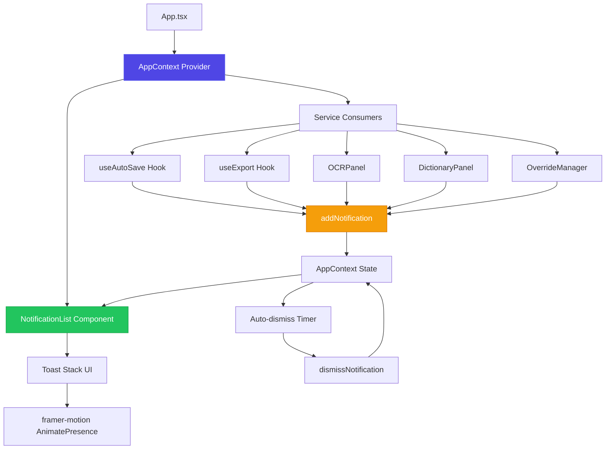
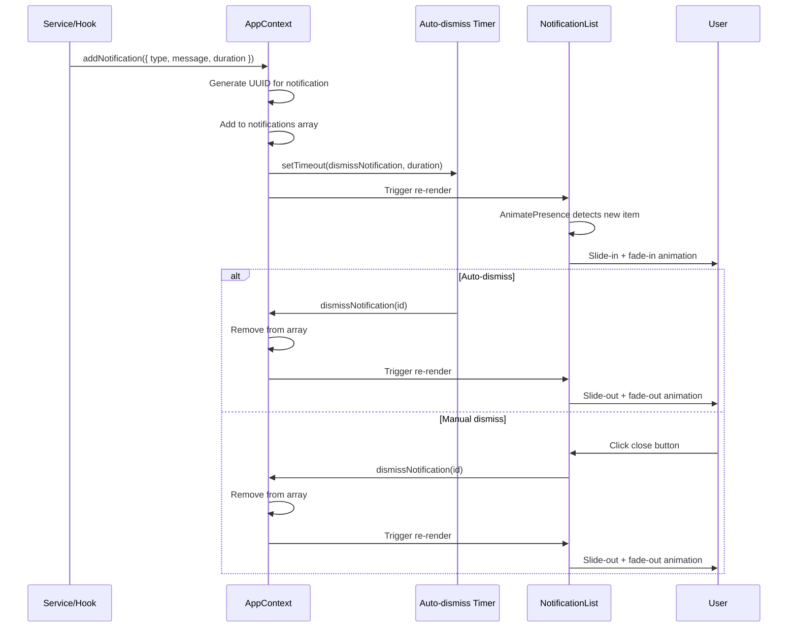

# Design Document: Notification System

## Overview

Hệ thống toast notification toàn cục cho Yao Editor v2, cung cấp feedback trực quan cho user về các thao tác quan trọng (lưu tài liệu, xuất file, nhận dạng OCR, lỗi API). Notification stack hiển thị góc trên phải màn hình với animation slide-in/fade-out mượt mà, tự động dismiss sau thời gian cấu hình, và hỗ trợ dismiss thủ công. Tích hợp sâu vào các service hiện có (AutoSave, Export, OCR, GemAI, OverrideManager) để thông báo kết quả thao tác.

## Architecture



## Main Algorithm/Workflow



## Components and Interfaces

### Component 1: AppContext (Extended)

**Purpose**: Quản lý state toàn cục cho notifications, cung cấp actions để thêm/xóa notification

**Interface**:
```typescript
interface Notification {
  id: string
  type: 'info' | 'success' | 'warning' | 'error'
  message: string
  duration?: number // milliseconds, default 4000
}

interface AppContextValue {
  // Existing fields
  activeTab: 'editor' | 'dictionary' | 'ocr'
  setActiveTab: (tab: 'editor' | 'dictionary' | 'ocr') => void
  theme: 'dark' | 'light'
  setTheme: (theme: 'dark' | 'light') => void
  
  // New notification fields
  notifications: Notification[]
  addNotification: (notif: Omit<Notification, 'id'>) => void
  dismissNotification: (id: string) => void
}
```

**Responsibilities**:
- Maintain notifications array state
- Generate unique IDs for notifications using `crypto.randomUUID()`
- Schedule auto-dismiss timers for each notification
- Provide actions to add/remove notifications
- Clean up timers on unmount

### Component 2: NotificationList

**Purpose**: Render toast stack UI với animation, hiển thị tất cả active notifications

**Interface**:
```typescript
interface NotificationListProps {
  // No props - consumes AppContext directly
}

interface NotificationCardProps {
  notification: Notification
  onDismiss: (id: string) => void
}
```

**Responsibilities**:
- Consume notifications from AppContext
- Render toast stack positioned `fixed top-4 right-4`
- Use framer-motion `AnimatePresence` for enter/exit animations
- Render individual NotificationCard for each notification
- Handle z-index layering (z-[100] to stay above all content)

### Component 3: NotificationCard (Internal)

**Purpose**: Render individual notification toast với icon, message, close button, progress bar

**Interface**:
```typescript
interface NotificationCardProps {
  notification: Notification
  onDismiss: (id: string) => void
}
```

**Responsibilities**:
- Display icon based on notification type (✓ success, ⚠ warning, ✕ error, ℹ info)
- Display message text with proper typography
- Render close button (× icon)
- Animate progress bar countdown (width from 100% to 0% over duration)
- Apply color scheme based on type (green success, yellow warning, red error, blue info)
- Handle click on close button to trigger dismiss

## Data Models

### Model 1: Notification

```typescript
interface Notification {
  id: string              // UUID generated by crypto.randomUUID()
  type: 'info' | 'success' | 'warning' | 'error'
  message: string         // Display text (Vietnamese)
  duration?: number       // Auto-dismiss delay in ms, default 4000
}
```

**Validation Rules**:
- `id` must be non-empty string (UUID format)
- `type` must be one of 4 allowed values
- `message` must be non-empty string, max 200 characters recommended
- `duration` must be positive integer if provided, default 4000ms

### Model 2: NotificationInput

```typescript
type NotificationInput = Omit<Notification, 'id'>
```

**Validation Rules**:
- Same as Notification except `id` is auto-generated
- Used as parameter type for `addNotification()`

## Algorithmic Pseudocode

### Main Processing Algorithm: addNotification

```typescript
ALGORITHM addNotification(input: NotificationInput)
INPUT: input of type NotificationInput (type, message, duration?)
OUTPUT: void (side effect: notification added to state)

BEGIN
  ASSERT input.type IN ['info', 'success', 'warning', 'error']
  ASSERT input.message.length > 0
  
  // Step 1: Generate unique ID
  id ← crypto.randomUUID()
  
  // Step 2: Create notification object with defaults
  duration ← input.duration ?? 4000
  notification ← { id, type: input.type, message: input.message, duration }
  
  // Step 3: Add to state array
  setNotifications(prev ← [...prev, notification])
  
  // Step 4: Schedule auto-dismiss timer
  timerId ← setTimeout(() => {
    dismissNotification(id)
  }, duration)
  
  // Step 5: Store timer reference for cleanup
  timerRefs.set(id, timerId)
END
```

**Preconditions**:
- `input.type` is valid notification type
- `input.message` is non-empty string
- `crypto.randomUUID()` is available (modern browser)

**Postconditions**:
- New notification is added to notifications array
- Auto-dismiss timer is scheduled
- Timer reference is stored for cleanup
- UI re-renders to show new notification

**Loop Invariants**: N/A (no loops in this algorithm)

### Validation Algorithm: dismissNotification

```typescript
ALGORITHM dismissNotification(id: string)
INPUT: id of type string (notification UUID)
OUTPUT: void (side effect: notification removed from state)

BEGIN
  ASSERT id.length > 0
  
  // Step 1: Clear timer if exists
  IF timerRefs.has(id) THEN
    clearTimeout(timerRefs.get(id))
    timerRefs.delete(id)
  END IF
  
  // Step 2: Remove from state array
  setNotifications(prev ← prev.filter(n => n.id !== id))
END
```

**Preconditions**:
- `id` parameter is provided (may or may not exist in state)

**Postconditions**:
- If notification exists, it is removed from array
- Associated timer is cleared if exists
- UI re-renders to trigger exit animation
- No side effects if notification doesn't exist

**Loop Invariants**: N/A (filter operation is atomic)

### Cleanup Algorithm: Component Unmount

```typescript
ALGORITHM cleanupTimers()
INPUT: none
OUTPUT: void (side effect: all timers cleared)

BEGIN
  // Clear all pending timers
  FOR each (id, timerId) IN timerRefs DO
    clearTimeout(timerId)
  END FOR
  
  // Clear timer map
  timerRefs.clear()
END
```

**Preconditions**:
- Component is unmounting
- timerRefs map may contain active timers

**Postconditions**:
- All setTimeout timers are cleared
- No memory leaks from pending timers
- timerRefs map is empty

**Loop Invariants**:
- All previously iterated timers are cleared
- timerRefs map size decreases by 1 each iteration

## Key Functions with Formal Specifications

### Function 1: addNotification()

```typescript
function addNotification(notif: Omit<Notification, 'id'>): void
```

**Preconditions:**
- `notif.type` is one of: 'info', 'success', 'warning', 'error'
- `notif.message` is non-empty string
- `notif.duration` is positive integer or undefined
- AppContext is mounted and available

**Postconditions:**
- New notification with generated UUID is added to state
- Auto-dismiss timer is scheduled for `duration` ms (default 4000)
- Timer reference is stored in cleanup map
- UI re-renders to show notification with slide-in animation
- No mutations to input parameter

**Loop Invariants:** N/A

### Function 2: dismissNotification()

```typescript
function dismissNotification(id: string): void
```

**Preconditions:**
- `id` is defined string (not null/undefined)
- AppContext is mounted and available

**Postconditions:**
- If notification with `id` exists, it is removed from state
- Associated timer is cleared if exists
- UI re-renders to trigger slide-out animation
- If `id` doesn't exist, no error thrown (idempotent)
- No side effects on other notifications

**Loop Invariants:** N/A

### Function 3: getNotificationIcon()

```typescript
function getNotificationIcon(type: Notification['type']): JSX.Element
```

**Preconditions:**
- `type` is one of: 'info', 'success', 'warning', 'error'

**Postconditions:**
- Returns JSX element for appropriate icon
- Icon matches notification type semantics
- Icon has consistent size and styling
- Pure function (no side effects)

**Loop Invariants:** N/A

## Example Usage

```typescript
// Example 1: Success notification from AutoSave
const { addNotification } = useAppContext()

useEffect(() => {
  if (saveStatus === 'saved') {
    addNotification({
      type: 'success',
      message: 'Đã lưu tài liệu',
      duration: 3000
    })
  }
}, [saveStatus, addNotification])

// Example 2: Error notification from Export
const handleExportError = (error: Error) => {
  addNotification({
    type: 'error',
    message: `Lỗi xuất PDF: ${error.message}`,
    duration: 5000
  })
}

// Example 3: Info notification from OCR
const handleOCRComplete = () => {
  addNotification({
    type: 'info',
    message: 'Nhận dạng hoàn tất',
    duration: 4000
  })
}

// Example 4: Warning notification from GemAI
const handleGeminiTimeout = () => {
  addNotification({
    type: 'warning',
    message: 'Gemini không phản hồi, thử lại sau',
    duration: 6000
  })
}

// Example 5: Manual dismiss
const { dismissNotification } = useAppContext()

const handleCloseClick = (notificationId: string) => {
  dismissNotification(notificationId)
}

// Example 6: Complete NotificationList component usage
function App() {
  return (
    <AppProvider>
      <div className="app-container">
        {/* Main content */}
        <YaoEditor />
        
        {/* Notification stack - always rendered at root level */}
        <NotificationList />
      </div>
    </AppProvider>
  )
}
```

## Correctness Properties

*A property is a characteristic or behavior that should hold true across all valid executions of a system—essentially, a formal statement about what the system should do. Properties serve as the bridge between human-readable specifications and machine-verifiable correctness guarantees.*

### Property 1: Unique Notification IDs

*For any* two distinct notifications in the notifications array, their IDs must be different.

**Validates: Requirements 1.1, 10.1, 10.3**

### Property 2: Notification Array Growth

*For any* valid notification input, adding it to the system shall increase the notifications array length by 1 (unless the max limit of 10 is reached).

**Validates: Requirements 1.2**

### Property 3: Timer Creation and Storage

*For any* notification added to the system, an auto-dismiss timer shall be created and its reference stored in the timer map.

**Validates: Requirements 1.3, 1.5**

### Property 4: Default Duration Application

*For any* notification added without a specified duration, the system shall use a default duration of 4000 milliseconds.

**Validates: Requirements 1.4**

### Property 5: Auto-dismiss Guarantee

*For any* notification in the system, after its duration expires, the notification shall be automatically removed from the notifications array.

**Validates: Requirements 3.1, 3.2**

### Property 6: Timer Cleanup on Dismiss

*For any* notification that is dismissed (manually or automatically), the associated auto-dismiss timer shall be cleared.

**Validates: Requirements 2.2, 8.1**

### Property 7: Idempotent Dismiss

*For any* string ID (whether valid or invalid), calling dismissNotification with that ID shall complete without throwing an error.

**Validates: Requirements 2.3**

### Property 8: Render Count Matches Array Length

*For any* notifications array, the number of rendered notification cards shall equal the array length.

**Validates: Requirements 4.3**

### Property 9: Close Button Presence

*For any* notification card rendered, a close button shall be present in the UI.

**Validates: Requirements 5.6**

### Property 10: Message Display

*For any* notification with a non-empty message, the message text shall be displayed in the notification card.

**Validates: Requirements 5.5, 11.2**

### Property 11: Progress Bar Presence

*For any* notification card rendered, a progress bar element shall be present at the bottom of the card.

**Validates: Requirements 7.1**

### Property 12: Timer Cleanup on Unmount

*For any* set of active timers, when the AppContext component unmounts, all timers shall be cleared and the timer reference map shall be emptied.

**Validates: Requirements 8.2, 8.3, 20.1, 20.2**

### Property 13: Maximum Notifications Limit

*For any* sequence of notification additions, the notifications array length shall never exceed 10, with the oldest notification removed when the limit is reached.

**Validates: Requirements 9.1, 9.2**

### Property 14: Type Validation

*For any* notification in the system, its type shall be one of: 'info', 'success', 'warning', 'error'.

**Validates: Requirements 11.1**

### Property 15: Duration Validation

*For any* notification with a specified duration, the duration shall be a positive integer.

**Validates: Requirements 11.3**

### Property 16: XSS Prevention

*For any* notification message containing HTML or script tags, the content shall be rendered as plain text and not executed as code.

**Validates: Requirements 17.2**

### Property 17: Message Length Handling

*For any* notification message exceeding the maximum length, the system shall handle it gracefully without causing UI overflow.

**Validates: Requirements 17.3**

### Property 18: Animation Consistency

*For any* notification, it shall enter with slide-in and fade-in animations, and exit with slide-out and fade-out animations.

**Validates: Requirements 6.1, 6.2, 6.3, 6.4**

### Property 19: Z-index Layering

*For any* UI state, the NotificationList shall have a z-index greater than all other UI components to ensure visibility.

**Validates: Requirements 4.2**

## Error Handling

### Error Scenario 1: crypto.randomUUID() Unavailable

**Condition**: Browser doesn't support `crypto.randomUUID()` (very old browsers)

**Response**: Fallback to timestamp-based ID generation: `Date.now().toString(36) + Math.random().toString(36)`

**Recovery**: System continues to function with slightly lower uniqueness guarantee

### Error Scenario 2: Timer Cleanup Race Condition

**Condition**: Auto-dismiss timer fires after component unmounts

**Response**: Check if component is still mounted before calling `setNotifications`

**Recovery**: No-op if unmounted, prevents React warning about state update on unmounted component

### Error Scenario 3: Excessive Notifications

**Condition**: Service calls `addNotification()` in rapid succession (e.g., 100+ times)

**Response**: Limit notifications array to max 10 items, remove oldest when adding new

**Recovery**: Prevent UI overflow and performance degradation

### Error Scenario 4: Invalid Notification Type

**Condition**: Service passes invalid type (e.g., 'debug', 'trace')

**Response**: TypeScript compile-time error prevents this; runtime fallback to 'info' type

**Recovery**: Notification still displays with default styling

## Testing Strategy

### Unit Testing Approach

**Test Suite 1: AppContext Notification Logic**
- Test `addNotification()` generates unique IDs
- Test `addNotification()` adds notification to state
- Test `addNotification()` schedules auto-dismiss timer
- Test `dismissNotification()` removes notification from state
- Test `dismissNotification()` clears associated timer
- Test `dismissNotification()` is idempotent (no error on non-existent ID)
- Test cleanup function clears all timers on unmount

**Test Suite 2: NotificationList Component**
- Test renders empty state when no notifications
- Test renders correct number of notification cards
- Test applies correct z-index and positioning
- Test passes correct props to NotificationCard children

**Test Suite 3: NotificationCard Component**
- Test renders correct icon for each type (info, success, warning, error)
- Test renders message text correctly
- Test renders close button
- Test close button calls `onDismiss` with correct ID
- Test applies correct color scheme for each type
- Test progress bar animates from 100% to 0% over duration

### Property-Based Testing Approach

**Property Test Library**: fast-check (JavaScript/TypeScript property-based testing)

**Property 1: ID Uniqueness**
```typescript
fc.assert(
  fc.property(
    fc.array(fc.record({ type: fc.constantFrom('info', 'success', 'warning', 'error'), message: fc.string() })),
    (inputs) => {
      const ids = inputs.map(() => crypto.randomUUID())
      const uniqueIds = new Set(ids)
      return ids.length === uniqueIds.size
    }
  )
)
```

**Property 2: Auto-dismiss Eventually Removes All**
```typescript
fc.assert(
  fc.property(
    fc.array(fc.record({ type: fc.constantFrom('info', 'success', 'warning', 'error'), message: fc.string(), duration: fc.integer({ min: 100, max: 1000 }) })),
    async (inputs) => {
      const { result } = renderHook(() => useAppContext(), { wrapper: AppProvider })
      
      inputs.forEach(input => result.current.addNotification(input))
      
      const maxDuration = Math.max(...inputs.map(i => i.duration))
      await new Promise(resolve => setTimeout(resolve, maxDuration + 100))
      
      return result.current.notifications.length === 0
    }
  )
)
```

**Property 3: Dismiss is Idempotent**
```typescript
fc.assert(
  fc.property(
    fc.string(),
    (id) => {
      const { result } = renderHook(() => useAppContext(), { wrapper: AppProvider })
      
      // Call dismiss multiple times
      result.current.dismissNotification(id)
      result.current.dismissNotification(id)
      result.current.dismissNotification(id)
      
      // Should not throw error
      return true
    }
  )
)
```

### Integration Testing Approach

**Integration Test 1: AutoSave → Notification**
- Trigger auto-save in editor
- Verify success notification appears
- Verify notification auto-dismisses after duration

**Integration Test 2: Export → Notification**
- Trigger PDF export
- Verify success notification appears on completion
- Trigger export error
- Verify error notification appears

**Integration Test 3: OCR → Notification**
- Complete OCR recognition
- Verify info notification appears
- Verify notification contains correct message

**Integration Test 4: GemAI → Notification**
- Trigger Gemini API error
- Verify error notification appears
- Verify notification contains error message

**Integration Test 5: OverrideManager → Notification**
- Add new dictionary entry
- Verify success notification appears
- Delete dictionary entry
- Verify success notification appears

## Performance Considerations

### Consideration 1: Animation Performance
- Use `framer-motion` with GPU-accelerated transforms (`translateX`, `opacity`)
- Avoid layout-triggering properties during animation
- Use `will-change: transform, opacity` for notification cards
- Limit max notifications to 10 to prevent excessive DOM nodes

### Consideration 2: Timer Management
- Store timer references in Map for O(1) lookup and cleanup
- Clear timers immediately on manual dismiss to prevent memory leaks
- Use `useCallback` for dismiss function to prevent unnecessary re-renders

### Consideration 3: Re-render Optimization
- Use `useCallback` for `addNotification` and `dismissNotification`
- Memoize notification cards with `React.memo` if performance issues arise
- Consider using `useReducer` instead of `useState` for complex state updates

### Consideration 4: Z-index Management
- Use fixed z-index value (z-[100]) to avoid z-index wars
- Ensure NotificationList is rendered at root level, not nested deep in component tree

## Security Considerations

### Consideration 1: XSS Prevention
- Sanitize notification messages if they contain user-generated content
- Use React's built-in XSS protection (text content, not `dangerouslySetInnerHTML`)
- Validate message length to prevent UI overflow attacks

### Consideration 2: Rate Limiting
- Implement max notifications limit (10) to prevent DoS via excessive notifications
- Consider debouncing rapid `addNotification` calls from same source

### Consideration 3: Content Security
- Ensure notification messages don't contain sensitive data (API keys, tokens)
- Truncate long error messages to prevent information leakage

## Dependencies

### External Dependencies
- `framer-motion` (v12.11.3) - Animation library for enter/exit transitions
- `react` (v19.1.0) - Core React library
- `crypto.randomUUID()` - Browser Web Crypto API for UUID generation

### Internal Dependencies
- `AppContext` - Global state management for notifications
- `useAppContext` hook - Access to notification actions
- Tailwind CSS v4 - Styling and responsive design
- Dark mode color scheme - Consistent with app theme

### Service Integration Points
- `useAutoSave` hook - Success notification on save
- `useExport` hook - Success/error notifications on export
- `OCRPanel` component - Info notification on OCR completion
- `DictionaryPanel` component - Error notification on GemAI failure
- `OverrideManager` component - Success notification on dictionary operations
