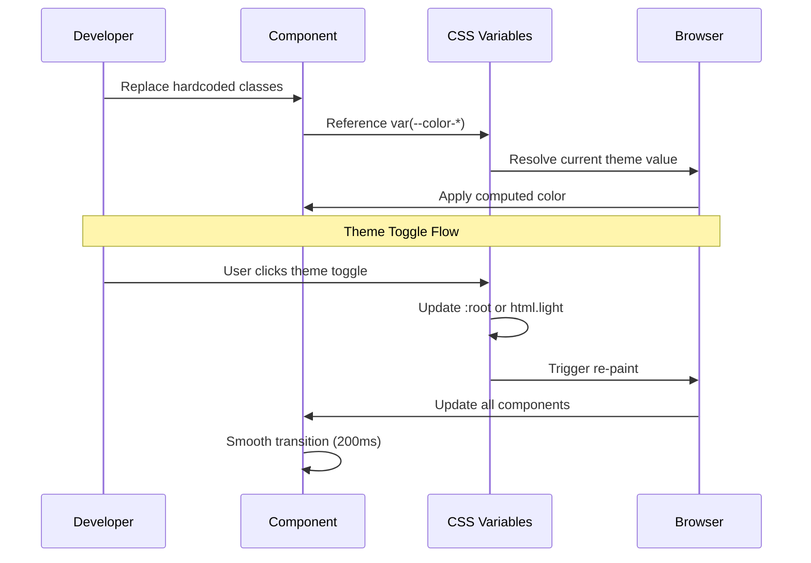

# Low-Level Design: Theme System Completion

## Overview

Tài liệu này cung cấp code examples chi tiết và implementation guidelines cho việc cập nhật từng component để hỗ trợ theme system. Mỗi component sẽ được refactor để sử dụng CSS variables thay vì hardcoded Tailwind classes.

## Main Algorithm/Workflow



## Core Interfaces/Types

### CSS Variable Reference

```typescript
// Type definitions for CSS variables (for documentation purposes)
type CSSColorVariable = 
  // Backgrounds
  | '--color-bg-primary'
  | '--color-bg-secondary'
  | '--color-bg-tertiary'
  | '--color-bg-toolbar'
  | '--color-bg-hover'
  | '--color-bg-active'
  | '--color-modal-backdrop'
  | '--color-modal-bg'
  | '--color-dropdown-bg'
  | '--color-panel-bg'
  | '--color-progress-bg'
  
  // Text
  | '--color-text-primary'
  | '--color-text-secondary'
  | '--color-text-tertiary'
  
  // Borders
  | '--color-border'
  | '--color-border-light'
  
  // Semantic Colors
  | '--color-primary'
  | '--color-primary-light'
  | '--color-primary-dark'
  | '--color-success'
  | '--color-error'
  | '--color-warning'
  | '--color-info'
  
  // Ruler Specific
  | '--color-ruler-bg'
  | '--color-ruler-border'
  | '--color-ruler-tick'
  | '--color-ruler-tick-major'
  | '--color-ruler-text'
  | '--color-ruler-overlay'

// Helper type for inline styles
interface ThemedStyle {
  backgroundColor?: string
  color?: string
  borderColor?: string
  [key: string]: string | undefined
}
```

### Component Refactor Pattern

```typescript
// Pattern for converting hardcoded classes to CSS variables

// BEFORE (❌ Bad)
<div className="bg-gray-900 text-gray-400 border-gray-700 hover:bg-gray-800">
  Content
</div>

// AFTER (✅ Good)
<div
  style={{
    backgroundColor: 'var(--color-bg-secondary)',
    color: 'var(--color-text-secondary)',
    borderColor: 'var(--color-border)',
  }}
  className="transition-colors"
  onMouseEnter={(e) => {
    e.currentTarget.style.backgroundColor = 'var(--color-bg-hover)'
  }}
  onMouseLeave={(e) => {
    e.currentTarget.style.backgroundColor = 'var(--color-bg-secondary)'
  }}
>
  Content
</div>
```

## Key Functions with Formal Specifications

### Function 1: updateCSSVariables()

```typescript
/**
 * Updates CSS variables in index.css
 * This is a one-time update, not a runtime function
 */
function updateCSSVariables(): void
```

**Preconditions:**
- `index.css` file exists and is writable
- All new variable names follow naming convention `--color-{category}-{variant}`

**Postconditions:**
- All new CSS variables are defined in `:root` (dark theme)
- All new CSS variables are defined in `html.light` (light theme)
- No existing variables are removed or modified
- Color values meet WCAG AA contrast requirements

**Implementation**:
```css
/* Add to :root in index.css */
:root {
  /* Existing variables... */
  
  /* New variables for modals/overlays */
  --color-modal-backdrop: rgba(0, 0, 0, 0.6);
  --color-modal-bg: rgba(15, 23, 42, 0.95);
  --color-dropdown-bg: rgba(17, 24, 39, 0.95);
  --color-panel-bg: rgba(17, 24, 39, 0.95);
  --color-progress-bg: rgba(31, 41, 59, 1);
  
  /* Ruler specific colors */
  --color-ruler-bg: #1e293b;
  --color-ruler-border: #334155;
  --color-ruler-tick: #475569;
  --color-ruler-tick-major: #6366f1;
  --color-ruler-text: #94a3b8;
  --color-ruler-overlay: rgba(15, 23, 42, 0.5);
}

/* Add to html.light in index.css */
html.light {
  /* Existing variables... */
  
  /* Light theme overrides */
  --color-modal-backdrop: rgba(0, 0, 0, 0.3);
  --color-modal-bg: rgba(255, 255, 255, 0.95);
  --color-dropdown-bg: rgba(255, 255, 255, 0.95);
  --color-panel-bg: rgba(255, 255, 255, 0.95);
  --color-progress-bg: rgba(243, 244, 246, 1);
  --color-ruler-bg: #f3f4f6;
  --color-ruler-border: #d1d5db;
  --color-ruler-tick: #9ca3af;
  --color-ruler-tick-major: #4f46e5;
  --color-ruler-text: #6b7280;
  --color-ruler-overlay: rgba(243, 244, 246, 0.5);
}
```

### Function 2: refactorComponent()

```typescript
/**
 * Refactors a component to use CSS variables
 * @param component - Component file path
 * @returns Updated component code
 */
function refactorComponent(component: string): string
```

**Preconditions:**
- Component file exists and is valid React/TypeScript
- Component uses Tailwind color classes
- CSS variables are defined in index.css

**Postconditions:**
- All hardcoded Tailwind color classes are replaced
- Component uses CSS variables via inline styles
- Hover/active states use event handlers
- `transition-colors` class is added for smooth transitions
- Component renders identically in both themes

**Loop Invariants:**
- For each element in component: if element has color class, it must be replaced with CSS variable

## Algorithmic Pseudocode

### Main Refactoring Algorithm

```pascal
ALGORITHM refactorAllComponents()
INPUT: componentList (array of component file paths)
OUTPUT: updatedComponents (array of refactored components)

BEGIN
  ASSERT componentList is not empty
  ASSERT CSS variables are defined in index.css
  
  updatedComponents ← empty array
  
  FOR each component IN componentList DO
    ASSERT component file exists
    
    // Step 1: Read component file
    code ← readFile(component)
    
    // Step 2: Find all Tailwind color classes
    colorClasses ← findTailwindColorClasses(code)
    
    // Step 3: Replace with CSS variables
    FOR each colorClass IN colorClasses DO
      cssVariable ← mapTailwindToCSSVariable(colorClass)
      code ← replaceClassWithInlineStyle(code, colorClass, cssVariable)
    END FOR
    
    // Step 4: Add transition classes
    code ← addTransitionClasses(code)
    
    // Step 5: Add hover handlers if needed
    code ← addHoverHandlers(code)
    
    // Step 6: Write updated component
    writeFile(component, code)
    updatedComponents.add(component)
    
    ASSERT component uses only CSS variables
    ASSERT no hardcoded color classes remain
  END FOR
  
  RETURN updatedComponents
END
```

**Preconditions:**
- componentList contains valid file paths
- All components are React/TypeScript files
- CSS variables are defined and accessible

**Postconditions:**
- All components in list are refactored
- No hardcoded Tailwind color classes remain
- All components support both themes
- Visual appearance is unchanged

**Loop Invariants:**
- All previously processed components use CSS variables
- No component is processed more than once
- File system remains consistent

### Color Class Mapping Algorithm

```pascal
ALGORITHM mapTailwindToCSSVariable(tailwindClass)
INPUT: tailwindClass (string) - e.g., "bg-gray-900"
OUTPUT: cssVariable (string) - e.g., "var(--color-bg-secondary)"

BEGIN
  ASSERT tailwindClass is valid Tailwind class
  
  // Parse class components
  prefix ← extractPrefix(tailwindClass)  // "bg", "text", "border"
  color ← extractColor(tailwindClass)    // "gray"
  shade ← extractShade(tailwindClass)    // "900"
  
  // Map to CSS variable
  IF prefix = "bg" THEN
    IF shade IN [900, 950] THEN
      RETURN "var(--color-bg-secondary)"
    ELSE IF shade IN [800, 850] THEN
      RETURN "var(--color-bg-hover)"
    ELSE IF shade IN [700, 750] THEN
      RETURN "var(--color-bg-active)"
    END IF
  ELSE IF prefix = "text" THEN
    IF shade IN [400, 500] THEN
      RETURN "var(--color-text-secondary)"
    ELSE IF shade IN [300, 200] THEN
      RETURN "var(--color-text-primary)"
    ELSE IF shade IN [600, 700] THEN
      RETURN "var(--color-text-tertiary)"
    END IF
  ELSE IF prefix = "border" THEN
    IF shade IN [700, 800] THEN
      RETURN "var(--color-border)"
    ELSE IF shade IN [600, 500] THEN
      RETURN "var(--color-border-light)"
    END IF
  END IF
  
  // Special cases for semantic colors
  IF color = "indigo" THEN
    RETURN "var(--color-primary)"
  ELSE IF color = "red" THEN
    RETURN "var(--color-error)"
  ELSE IF color = "green" THEN
    RETURN "var(--color-success)"
  END IF
  
  // Fallback
  RETURN "var(--color-bg-primary)"
END
```

**Preconditions:**
- tailwindClass is a valid Tailwind CSS class string
- Class follows pattern: `{prefix}-{color}-{shade}`

**Postconditions:**
- Returns valid CSS variable reference
- Variable exists in index.css
- Mapping is semantically correct

## Example Usage

### Example 1: Refactoring ExportMenu

**Before**:
```typescript
<button
  className={`flex items-center gap-1.5 px-3 py-1.5 rounded-lg text-[10px] font-bold transition-all border ${
    isExporting
      ? 'bg-indigo-600/10 border-indigo-500/30 text-indigo-400'
      : 'bg-gray-800 border-gray-700 text-gray-400 hover:border-gray-600 hover:text-gray-200'
  }`}
>
  XUẤT
</button>
```

**After**:
```typescript
<button
  style={{
    backgroundColor: isExporting 
      ? 'rgba(79, 70, 229, 0.1)' 
      : 'var(--color-bg-secondary)',
    borderColor: isExporting
      ? 'rgba(79, 70, 229, 0.3)'
      : 'var(--color-border)',
    color: isExporting
      ? 'var(--color-primary)'
      : 'var(--color-text-secondary)',
  }}
  className="flex items-center gap-1.5 px-3 py-1.5 rounded-lg text-[10px] font-bold transition-all border"
  onMouseEnter={(e) => {
    if (!isExporting) {
      e.currentTarget.style.borderColor = 'var(--color-border-light)'
      e.currentTarget.style.color = 'var(--color-text-primary)'
    }
  }}
  onMouseLeave={(e) => {
    if (!isExporting) {
      e.currentTarget.style.borderColor = 'var(--color-border)'
      e.currentTarget.style.color = 'var(--color-text-secondary)'
    }
  }}
>
  XUẤT
</button>
```

### Example 2: Refactoring LayoutModal

**Before**:
```typescript
<motion.div
  className="fixed top-1/2 left-1/2 -translate-x-1/2 -translate-y-1/2 z-[210] w-[480px] border rounded-2xl shadow-2xl overflow-hidden"
  style={{
    backgroundColor: 'rgba(15, 23, 42, 0.95)',
    borderColor: 'rgba(55, 65, 81, 0.5)',
  }}
>
```

**After**:
```typescript
<motion.div
  className="fixed top-1/2 left-1/2 -translate-x-1/2 -translate-y-1/2 z-[210] w-[480px] border rounded-2xl shadow-2xl overflow-hidden"
  style={{
    backgroundColor: 'var(--color-modal-bg)',
    borderColor: 'var(--color-border)',
  }}
>
```

### Example 3: Refactoring ModeToggle

**Before**:
```typescript
<div className="flex bg-gray-800 p-1 rounded-lg border border-gray-700/50">
  <button
    className={`px-3 py-1 rounded-md text-[10px] font-bold transition-all ${
      writingMode === 'horizontal-tb'
        ? 'bg-gray-700 text-white shadow-sm'
        : 'text-gray-500 hover:text-gray-300'
    }`}
  >
    NGANG
  </button>
</div>
```

**After**:
```typescript
<div 
  style={{
    backgroundColor: 'var(--color-bg-secondary)',
    borderColor: 'var(--color-border)',
  }}
  className="flex p-1 rounded-lg border transition-colors"
>
  <button
    style={{
      backgroundColor: writingMode === 'horizontal-tb' 
        ? 'var(--color-bg-active)' 
        : 'transparent',
      color: writingMode === 'horizontal-tb'
        ? 'var(--color-text-primary)'
        : 'var(--color-text-tertiary)',
    }}
    className="px-3 py-1 rounded-md text-[10px] font-bold transition-all"
    onMouseEnter={(e) => {
      if (writingMode !== 'horizontal-tb') {
        e.currentTarget.style.color = 'var(--color-text-secondary)'
      }
    }}
    onMouseLeave={(e) => {
      if (writingMode !== 'horizontal-tb') {
        e.currentTarget.style.color = 'var(--color-text-tertiary)'
      }
    }}
  >
    NGANG
  </button>
</div>
```

### Example 4: Refactoring CandidateBar

**Before**:
```typescript
<motion.div
  className="fixed z-[9999] bg-gray-900/95 backdrop-blur-md border border-gray-700/50 rounded-lg shadow-2xl overflow-hidden min-w-[200px]"
>
  <div className="bg-gray-800/50 px-3 py-1.5 border-b border-gray-700/50">
    <span className="text-indigo-400 font-mono text-xs font-bold">
      {transformedPreedit}
    </span>
  </div>
</motion.div>
```

**After**:
```typescript
<motion.div
  style={{
    backgroundColor: 'var(--color-dropdown-bg)',
    borderColor: 'var(--color-border)',
  }}
  className="fixed z-[9999] backdrop-blur-md border rounded-lg shadow-2xl overflow-hidden min-w-[200px] transition-colors"
>
  <div 
    style={{
      backgroundColor: 'var(--color-bg-hover)',
      borderColor: 'var(--color-border)',
    }}
    className="px-3 py-1.5 border-b transition-colors"
  >
    <span 
      style={{ color: 'var(--color-primary)' }}
      className="font-mono text-xs font-bold"
    >
      {transformedPreedit}
    </span>
  </div>
</motion.div>
```

### Example 5: Refactoring Ruler

**Before**:
```typescript
<div
  style={{
    width: '210mm',
    height: '28px',
    background: '#1e293b',
    border: '1px solid #334155',
    borderRadius: '6px',
  }}
>
  <span style={{
    fontSize: '9px',
    color: '#94a3b8',
    fontFamily: 'monospace',
  }}>
    {cm}
  </span>
</div>
```

**After**:
```typescript
<div
  style={{
    width: '210mm',
    height: '28px',
    background: 'var(--color-ruler-bg)',
    border: '1px solid var(--color-ruler-border)',
    borderRadius: '6px',
  }}
  className="transition-colors"
>
  <span style={{
    fontSize: '9px',
    color: 'var(--color-ruler-text)',
    fontFamily: 'monospace',
  }}>
    {cm}
  </span>
</div>
```

### Example 6: Refactoring DictionaryPanel

**Before**:
```typescript
<motion.div
  className="fixed right-0 top-0 h-full w-[320px] bg-gray-900/95 backdrop-blur-xl border-l border-gray-800 z-[70] flex flex-col shadow-2xl"
>
  <div className="shrink-0 px-4 py-3 border-b border-gray-800">
    <h2 className="text-sm font-bold text-white">TỪ ĐIỂN</h2>
  </div>
</motion.div>
```

**After**:
```typescript
<motion.div
  style={{
    backgroundColor: 'var(--color-panel-bg)',
    borderColor: 'var(--color-border)',
  }}
  className="fixed right-0 top-0 h-full w-[320px] backdrop-blur-xl border-l z-[70] flex flex-col shadow-2xl transition-colors"
>
  <div 
    style={{
      borderColor: 'var(--color-border)',
    }}
    className="shrink-0 px-4 py-3 border-b transition-colors"
  >
    <h2 
      style={{ color: 'var(--color-text-primary)' }}
      className="text-sm font-bold"
    >
      TỪ ĐIỂN
    </h2>
  </div>
</motion.div>
```

## Component-Specific Implementation Details

### 1. ExportMenu.tsx

**Changes Required**:
- Replace `bg-gray-900/95` → `var(--color-dropdown-bg)`
- Replace `border-gray-700` → `var(--color-border)`
- Replace `text-gray-400` → `var(--color-text-secondary)`
- Replace `hover:bg-gray-800/80` → hover handler with `var(--color-bg-hover)`
- Replace `text-gray-300` → `var(--color-text-primary)`
- Replace `bg-gray-950/80` → `var(--color-modal-backdrop)`

**Estimated Lines Changed**: ~50 lines

### 2. LayoutModal.tsx

**Changes Required**:
- Replace modal backdrop `rgba(0, 0, 0, 0.6)` → `var(--color-modal-backdrop)`
- Replace modal bg `rgba(15, 23, 42, 0.95)` → `var(--color-modal-bg)`
- Replace all `border-gray-800` → `var(--color-border)`
- Replace all `text-gray-500` → `var(--color-text-tertiary)`
- Replace all `bg-gray-800` → `var(--color-bg-secondary)`
- Add hover handlers for interactive elements

**Estimated Lines Changed**: ~80 lines

### 3. ModeToggle.tsx

**Changes Required**:
- Replace `bg-gray-800` → `var(--color-bg-secondary)`
- Replace `border-gray-700/50` → `var(--color-border)`
- Replace `bg-gray-700` → `var(--color-bg-active)`
- Replace `text-gray-500` → `var(--color-text-tertiary)`
- Replace `hover:text-gray-300` → hover handler
- Add `transition-colors` class

**Estimated Lines Changed**: ~40 lines

### 4. CandidateBar.tsx

**Changes Required**:
- Replace `bg-gray-900/95` → `var(--color-dropdown-bg)`
- Replace `border-gray-700/50` → `var(--color-border)`
- Replace `bg-gray-800/50` → `var(--color-bg-hover)`
- Replace `text-indigo-400` → `var(--color-primary)`
- Replace `hover:bg-gray-800` → hover handler
- Replace `text-gray-300` → `var(--color-text-primary)`

**Estimated Lines Changed**: ~60 lines

### 5. Ruler.tsx

**Changes Required**:
- Replace `background: '#1e293b'` → `var(--color-ruler-bg)`
- Replace `border: '1px solid #334155'` → `var(--color-ruler-border)`
- Replace `color: '#94a3b8'` → `var(--color-ruler-text)`
- Replace `background: '#6366f1'` → `var(--color-ruler-tick-major)`
- Replace `background: '#475569'` → `var(--color-ruler-tick)`
- Replace overlay `rgba(15, 23, 42, 0.5)` → `var(--color-ruler-overlay)`

**Estimated Lines Changed**: ~30 lines

### 6. DictionaryPanel.tsx

**Changes Required**:
- Replace `bg-gray-900/95` → `var(--color-panel-bg)`
- Replace `border-gray-800` → `var(--color-border)`
- Replace `text-white` → `var(--color-text-primary)`
- Replace `text-gray-500` → `var(--color-text-tertiary)`
- Replace `bg-gray-800` → `var(--color-bg-secondary)`
- Replace `hover:bg-gray-800/80` → hover handler
- Add `transition-colors` throughout

**Estimated Lines Changed**: ~100 lines

### 7. NotificationCard.tsx

**Changes Required**:
- Update gradient backgrounds to use CSS variables
- Replace hardcoded color values with semantic variables
- Ensure contrast ratios meet WCAG AA
- Add dark mode variants for all notification types

**Estimated Lines Changed**: ~40 lines

### 8. Header.tsx

**Changes Required**:
- Currently empty component (TODO: M23)
- Will need full theme support when implemented
- Use CSS variables from the start

**Estimated Lines Changed**: TBD (component not yet implemented)

## Testing Checklist

### Visual Testing

- [ ] All components render correctly in dark theme
- [ ] All components render correctly in light theme
- [ ] Theme toggle transitions smoothly (< 200ms)
- [ ] No visual regressions compared to original
- [ ] Hover states work in both themes
- [ ] Active states work in both themes
- [ ] Focus states visible in both themes

### Functional Testing

- [ ] Theme persists across page reloads
- [ ] Theme toggle button works
- [ ] All interactive elements respond correctly
- [ ] No console errors or warnings
- [ ] Performance is acceptable (< 100ms toggle)

### Accessibility Testing

- [ ] Contrast ratios meet WCAG AA (4.5:1 for text)
- [ ] Keyboard navigation works
- [ ] Screen reader announces theme changes
- [ ] Focus indicators visible
- [ ] Color is not the only means of conveying information

### Browser Testing

- [ ] Chrome (latest)
- [ ] Firefox (latest)
- [ ] Safari (latest)
- [ ] Edge (latest)

## Performance Optimization

### CSS Variable Performance

**Measurement**:
```typescript
// Measure theme toggle performance
const start = performance.now()
toggleTheme()
requestAnimationFrame(() => {
  const end = performance.now()
  console.log(`Theme toggle took ${end - start}ms`)
  // Should be < 100ms
})
```

### Transition Optimization

**Best Practices**:
- Use `transition-colors` utility class
- Avoid animating layout properties
- Use GPU-accelerated properties when possible
- Keep transition duration consistent (200ms)

### Memory Optimization

**Guidelines**:
- Don't store color values in component state
- Let CSS variables handle color management
- Minimize inline style objects
- Reuse style objects when possible

## Rollback Strategy

### If Issues Arise

1. **Identify Problem Component**:
   ```bash
   git diff HEAD~1 src/components/editor/ExportMenu.tsx
   ```

2. **Revert Specific Component**:
   ```bash
   git checkout HEAD~1 -- src/components/editor/ExportMenu.tsx
   ```

3. **Keep CSS Variables**:
   - CSS variables don't harm anything
   - Can be used incrementally

4. **Fix and Re-apply**:
   - Debug issue in isolation
   - Test thoroughly
   - Re-apply changes

### Success Criteria

✅ **Complete** when:
- All components use CSS variables
- No hardcoded Tailwind color classes remain
- WCAG AA contrast compliance verified
- Theme toggle < 100ms
- No visual regressions
- All tests pass

## Migration Timeline

### Week 1: Foundation
- Day 1-2: Add new CSS variables to index.css
- Day 3-4: Refactor ModeToggle (simplest component)
- Day 5: Test and verify

### Week 2: Core Components
- Day 1-2: Refactor ExportMenu
- Day 3-4: Refactor LayoutModal
- Day 5: Refactor CandidateBar

### Week 3: Panels
- Day 1-3: Refactor DictionaryPanel
- Day 4: Refactor OCRPanel
- Day 5: Refactor Ruler

### Week 4: Polish
- Day 1-2: Refactor remaining components
- Day 3-4: Comprehensive testing
- Day 5: Documentation and cleanup

## Conclusion

This low-level design provides concrete code examples and implementation guidelines for completing the theme system. Each component follows the same pattern: replace hardcoded classes with CSS variables, add transition classes, and implement hover handlers where needed. The result is a consistent, maintainable, and accessible theme system that works seamlessly across all components.
