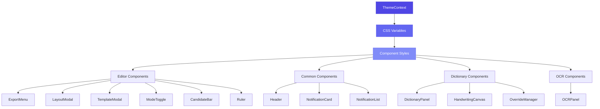
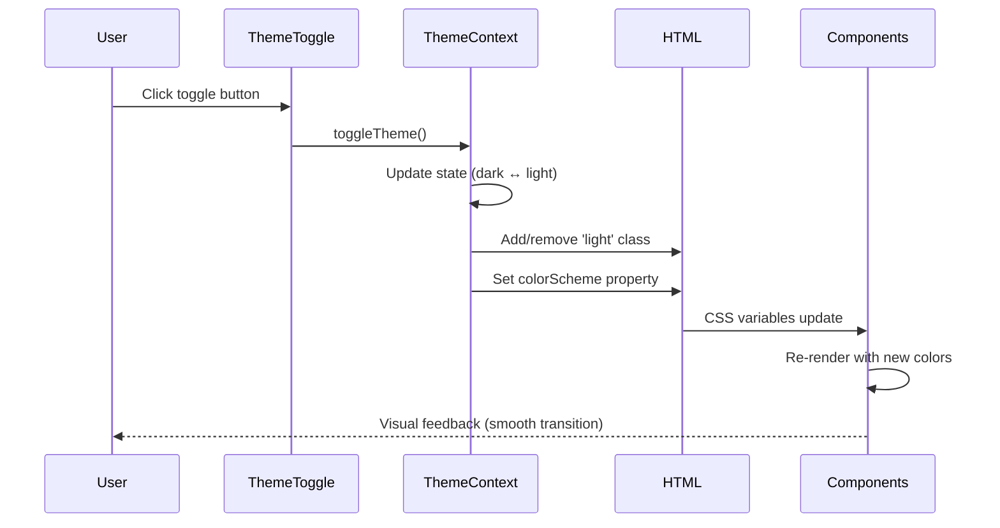

# Design Document: Theme System Completion

## Overview

Hệ thống theme hiện tại của Yao Editor v2 đã có nền tảng cơ bản với ThemeContext và CSS variables, nhưng còn nhiều component chưa được tích hợp đầy đủ. Thiết kế này nhằm hoàn thiện hệ thống theme để đảm bảo tất cả các component hỗ trợ dark/light mode một cách nhất quán, với text colors có contrast tốt và transitions mượt mà.

Mục tiêu chính là loại bỏ các hardcoded Tailwind classes (như `bg-gray-900`, `text-gray-400`) và thay thế bằng CSS variables, đồng thời đảm bảo tuân thủ WCAG contrast ratio cho accessibility.

## Architecture



### Theme Flow Sequence



## Components and Interfaces

### 1. ThemeContext (Existing - No Changes)

**Purpose**: Quản lý theme state và cung cấp toggle functionality

**Interface**:
```typescript
interface ThemeContextValue {
  theme: 'light' | 'dark'
  setTheme: (theme: 'light' | 'dark') => void
  toggleTheme: () => void
}
```

**Responsibilities**:
- Lưu trữ theme state
- Persist theme preference vào localStorage
- Apply theme class vào HTML element
- Provide theme context cho toàn bộ app

### 2. CSS Variables System

**Purpose**: Định nghĩa color tokens cho cả dark và light theme

**Current Variables** (trong `index.css`):
```css
:root {
  /* Dark Theme (Default) */
  --color-bg-primary: #030712;
  --color-bg-secondary: #0f172a;
  --color-bg-tertiary: #1e293b;
  --color-text-primary: #f9fafb;
  --color-text-secondary: #d1d5db;
  --color-text-tertiary: #9ca3af;
  --color-border: #1f2937;
  --color-border-light: #374151;
  --color-bg-toolbar: #111827;
  --color-bg-hover: #1f2937;
  --color-bg-active: #374151;
  
  /* Premium Colors */
  --color-primary: #4f46e5;
  --color-primary-light: #6366f1;
  --color-primary-dark: #4338ca;
  --color-success: #10b981;
  --color-error: #ef4444;
  --color-warning: #f59e0b;
  --color-info: #3b82f6;
}

html.light {
  --color-bg-primary: #ffffff;
  --color-bg-secondary: #f9fafb;
  --color-bg-tertiary: #f3f4f6;
  --color-text-primary: #111827;
  --color-text-secondary: #374151;
  --color-text-tertiary: #6b7280;
  --color-border: #e5e7eb;
  --color-border-light: #d1d5db;
  --color-bg-toolbar: #f3f4f6;
  --color-bg-hover: #e5e7eb;
  --color-bg-active: #d1d5db;
}
```

**New Variables Needed**:
```css
:root {
  /* Modal/Overlay backgrounds */
  --color-modal-backdrop: rgba(0, 0, 0, 0.6);
  --color-modal-bg: rgba(15, 23, 42, 0.95);
  
  /* Dropdown/Menu backgrounds */
  --color-dropdown-bg: rgba(17, 24, 39, 0.95);
  
  /* Panel backgrounds */
  --color-panel-bg: rgba(17, 24, 39, 0.95);
  
  /* Progress bar */
  --color-progress-bg: rgba(31, 41, 59, 1);
  
  /* Ruler specific */
  --color-ruler-bg: #1e293b;
  --color-ruler-border: #334155;
  --color-ruler-tick: #475569;
  --color-ruler-tick-major: #6366f1;
  --color-ruler-text: #94a3b8;
  --color-ruler-overlay: rgba(15, 23, 42, 0.5);
}

html.light {
  --color-modal-backdrop: rgba(0, 0, 0, 0.3);
  --color-modal-bg: rgba(255, 255, 255, 0.95);
  --color-dropdown-bg: rgba(255, 255, 255, 0.95);
  --color-panel-bg: rgba(255, 255, 255, 0.95);
  --color-progress-bg: rgba(243, 244, 246, 1);
  --color-ruler-bg: #f3f4f6;
  --color-ruler-border: #d1d5db;
  --color-ruler-tick: #9ca3af;
  --color-ruler-tick-major: #4f46e5;
  --color-ruler-text: #6b7280;
  --color-ruler-overlay: rgba(243, 244, 246, 0.5);
}
```

### 3. Component Update Pattern

**Purpose**: Chuẩn hóa cách components sử dụng theme

**Pattern**:
```typescript
// ❌ BAD - Hardcoded Tailwind classes
<div className="bg-gray-900 text-gray-400 border-gray-700">

// ✅ GOOD - CSS variables with inline styles
<div 
  style={{
    backgroundColor: 'var(--color-bg-secondary)',
    color: 'var(--color-text-secondary)',
    borderColor: 'var(--color-border)',
  }}
  className="transition-colors"
>

// ✅ GOOD - CSS variables with hover states
<button
  style={{
    backgroundColor: 'var(--color-bg-secondary)',
    color: 'var(--color-text-secondary)',
  }}
  onMouseEnter={(e) => {
    e.currentTarget.style.backgroundColor = 'var(--color-bg-hover)'
    e.currentTarget.style.color = 'var(--color-text-primary)'
  }}
  onMouseLeave={(e) => {
    e.currentTarget.style.backgroundColor = 'var(--color-bg-secondary)'
    e.currentTarget.style.color = 'var(--color-text-secondary)'
  }}
>
```

## Data Models

### Theme State Model

```typescript
type Theme = 'light' | 'dark'

interface ThemeState {
  current: Theme
  systemPreference: Theme
  userPreference: Theme | null
}
```

### Component Theme Props

```typescript
interface ThemedComponentProps {
  // Components không cần theme prop vì sử dụng CSS variables
  // CSS variables tự động update khi theme thay đổi
}
```

## Correctness Properties

### Universal Quantification Statements

1. **Theme Consistency**: ∀ component ∈ Components, component MUST use CSS variables for colors
2. **Contrast Compliance**: ∀ (text, background) pair, contrast ratio ≥ 4.5:1 (WCAG AA)
3. **Transition Smoothness**: ∀ color property, transition duration = 200ms with cubic-bezier easing
4. **No Hardcoded Colors**: ∀ component ∈ Components, ¬∃ hardcoded Tailwind color classes
5. **Theme Persistence**: ∀ theme change, localStorage MUST be updated
6. **Bidirectional Support**: ∀ theme ∈ {dark, light}, all components MUST render correctly

## Error Handling

### Error Scenario 1: Theme Context Not Available

**Condition**: Component tries to use theme outside ThemeProvider
**Response**: Throw descriptive error with setup instructions
**Recovery**: Wrap app with ThemeProvider in main.tsx

### Error Scenario 2: CSS Variable Not Defined

**Condition**: Component references undefined CSS variable
**Response**: Browser falls back to default color (may look broken)
**Recovery**: Add missing variable to index.css for both themes

### Error Scenario 3: localStorage Access Denied

**Condition**: Browser blocks localStorage (private mode, security settings)
**Response**: Theme still works but doesn't persist
**Recovery**: Use in-memory state only, show warning notification

## Testing Strategy

### Unit Testing Approach

**Test Coverage**:
- ThemeContext state management
- Theme toggle functionality
- localStorage persistence
- CSS variable application

**Key Test Cases**:
1. Theme toggles between dark and light
2. Theme persists across page reloads
3. System preference detection works
4. HTML class updates correctly

### Visual Regression Testing

**Approach**: Screenshot comparison for each component in both themes

**Test Cases**:
1. All components in dark theme
2. All components in light theme
3. Theme transition animations
4. Hover states in both themes
5. Active states in both themes

### Accessibility Testing

**WCAG Compliance**:
- Contrast ratio testing for all text/background pairs
- Keyboard navigation in both themes
- Screen reader compatibility

**Tools**:
- axe DevTools for automated checks
- Manual testing with NVDA/JAWS
- Color contrast analyzer

## Performance Considerations

### CSS Variable Performance

**Optimization**: CSS variables are highly performant
- Browser-native feature
- No JavaScript overhead for color updates
- Efficient re-painting

**Measurement**: Theme toggle should complete in < 100ms

### Transition Performance

**Strategy**: Use GPU-accelerated properties
- `opacity` and `transform` for animations
- Avoid animating `width`, `height`, `top`, `left`
- Use `will-change` sparingly

### Memory Considerations

**Theme State**: Minimal memory footprint
- Single theme string in context
- No color value storage in JavaScript
- CSS variables handled by browser

## Security Considerations

### localStorage Security

**Risk**: XSS attacks could modify theme preference
**Mitigation**: 
- Validate theme value before applying
- Only accept 'light' or 'dark' strings
- Sanitize any user input

**Implementation**:
```typescript
const savedTheme = localStorage.getItem('theme')
if (savedTheme === 'light' || savedTheme === 'dark') {
  setTheme(savedTheme)
}
```

### CSS Injection Prevention

**Risk**: Malicious CSS variable injection
**Mitigation**:
- Never use user input in CSS variables
- All color values defined in index.css
- No dynamic CSS variable creation

## Dependencies

### Required Libraries

- **React**: ^18.x (existing)
- **Framer Motion**: ^10.x (existing) - for smooth transitions
- **Tailwind CSS**: ^3.x (existing) - for utility classes (non-color)

### Browser Support

- **Modern Browsers**: Chrome 49+, Firefox 31+, Safari 9.1+, Edge 15+
- **CSS Variables**: Fully supported in all target browsers
- **Color Scheme**: Supported in all modern browsers

### Development Tools

- **TypeScript**: Type safety for theme values
- **ESLint**: Lint rules to prevent hardcoded colors
- **Prettier**: Consistent code formatting

## Implementation Priority

### Phase 1: High Priority (Core UI)
1. ExportMenu
2. LayoutModal
3. ModeToggle
4. CandidateBar

### Phase 2: Medium Priority (Panels)
5. DictionaryPanel
6. OCRPanel
7. Ruler

### Phase 3: Low Priority (Remaining)
8. Header
9. NotificationCard
10. NotificationList
11. HandwritingCanvas
12. OverrideManager
13. TemplateModal

## Migration Strategy

### Step-by-Step Process

1. **Add New CSS Variables**: Update index.css with new variables
2. **Update One Component**: Start with simplest component (ModeToggle)
3. **Test Thoroughly**: Verify both themes work correctly
4. **Repeat**: Move to next component
5. **Remove Old Code**: Clean up hardcoded classes
6. **Final Review**: Check all components in both themes

### Rollback Plan

If issues arise:
1. Revert specific component changes
2. Keep CSS variables (no harm)
3. Fix issues in isolation
4. Re-apply changes

### Success Criteria

- ✅ All components use CSS variables
- ✅ No hardcoded Tailwind color classes
- ✅ WCAG AA contrast compliance
- ✅ Smooth transitions (< 200ms)
- ✅ Theme persists across reloads
- ✅ No visual regressions
